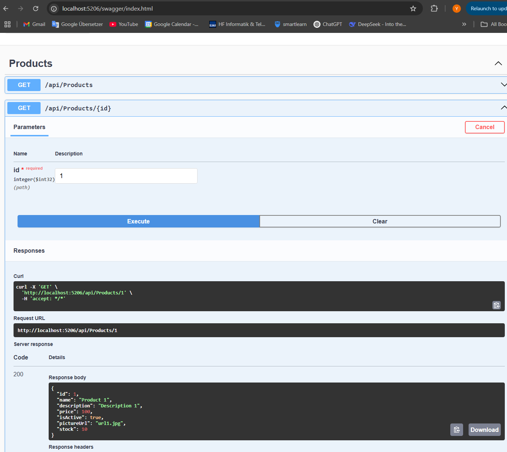
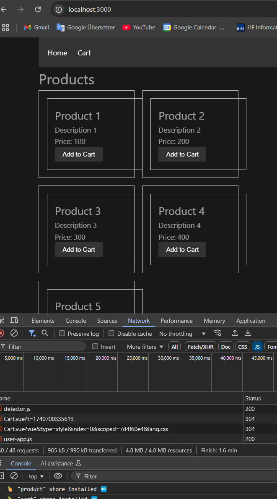
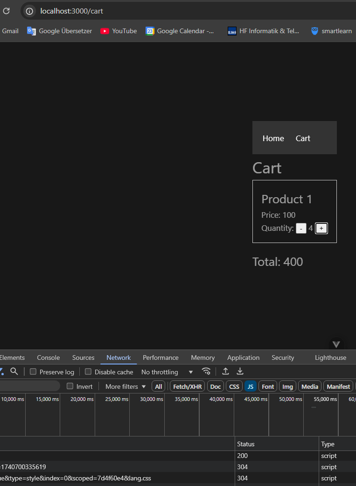

# E-Commerce Application

This is a full-stack e-commerce application built with .NET Core for the backend API and Vue 3 for the frontend client. The application allows users to browse products, add them to a cart, and manage the cart items.

## Features

- Browse products
- Add products to the cart
- Increase or decrease product quantities in the cart
- View total price in the cart
- Responsive design

## Technologies Used

- .NET Core 6.0
- Entity Framework Core
- Vue 3
- Pinia (state management)
- Axios (HTTP client)
- Vue Router

## Getting Started

### Prerequisites

- .NET Core SDK 6.0 or later
- Node.js 14.x or later
- npm (Node Package Manager)

### Backend Setup

1. Clone the repository:

   ```sh
   git clone https://github.com/yavuzoz/vuejs3-dotnet-ecommerce.git
   cd uejs3-dotnet-ecommerce
   ````

2. Navigate to the API project directory:

   ```sh
   cd API
   ```

3. Restore the .NET dependencies:

   ```sh
   dotnet restore
   ```

4. Update the database:

   ```sh
   dotnet ef database update
   ```

5. Run the API:

   ```sh
   dotnet run
   ```

   The API will be running at `http://localhost:5206`.

### Frontend Setup

1. Navigate to the client project directory:

   ```sh
   cd Client
   ```

2. Install the npm dependencies:

   ```sh
   npm install
   ```

3. Run the Vue.js development server:

   ```sh
   npm run dev
   ```

   The frontend will be running at `http://localhost:3000`.

## Project Structure

### Backend (API)

- `Controllers/ProductsController.cs`: Handles API requests for products.
- `Data/DataContext.cs`: Entity Framework Core data context.
- `Models/Product.cs`: Product entity model.
- `Program.cs`: Configures and runs the .NET Core application.
  


### Frontend (Client)

- `src/components/Header.vue`: Header component with navigation links.
- Product.vue: Product component to display individual product details.
- `src/components/ProductList.vue`: ProductList component to display a list of products.
- `src/views/HomeView.vue`: Home view to display products.
- `src/views/Cart.vue`: Cart view to manage cart items.
- `src/store/productStore.js`: Pinia store for managing product state.
- `src/store/cartStore.js`: Pinia store for managing cart state.
- `src/router/index.js`: Vue Router configuration.





## Usage

1. Open the browser and navigate to `http://localhost:3000`.
2. Browse the products on the home page.
3. Click "Add to Cart" to add products to the cart.
4. Navigate to the cart page to view and manage cart items.

## Contributing

Contributions are welcome! Please fork the repository and create a pull request with your changes.

## License

This project is licensed under the MIT License. See the LICENSE file for details.
